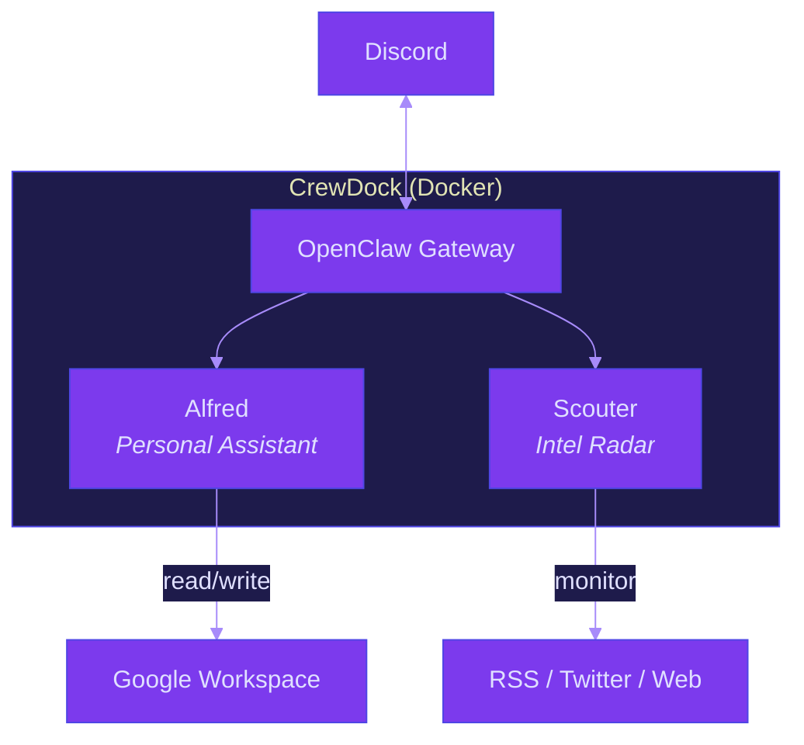

<p align="center">
  <picture>
    <source media="(prefers-color-scheme: dark)" srcset="brand/logo-horizontal.svg">
    <source media="(prefers-color-scheme: light)" srcset="brand/logo-horizontal-dark.svg">
    
  </picture>
</p>

<p align="center">
  A self-hosted AI crew that runs 24/7 on your server.<br>
  Specialized agents working autonomously in Docker, built on <a href="https://github.com/openclaw/openclaw">OpenClaw</a>.
</p>

<p align="center">
  <a href="LICENSE"></a>
  <a href="https://www.docker.com/"></a>
  <a href="https://github.com/openclaw/openclaw"></a>
  <a href="https://buymeacoffee.com/dasirra"></a>
</p>

## Architecture



## What is CrewDock

CrewDock turns a Docker host into a 24/7 AI operations center. It runs
[OpenClaw](https://github.com/openclaw/openclaw) as the gateway, adds a crew of
specialized agents, and wires everything to Discord so you can monitor and
interact from your phone.

The agents run on cron schedules or on demand. Each one has its own workspace,
config, and database. You deploy once and they take it from there.

## The Agents

### Alfred — Personal Assistant

Daily briefings and Google Workspace access (Gmail, Calendar, Tasks) via
Discord. On first message, Alfred walks you through setting your briefing
schedule. After that, it delivers a morning summary on cron and answers
workspace queries on demand.

### Scouter — Intel Radar

Monitors AI/tech sources (RSS, Twitter/X, web pages) and drafts engagement
posts in your voice for Twitter/X. Never publishes automatically — all
drafts go through you on Discord.

**Sources config** (`config.json`):

```json
{
  "timezone": "America/New_York",
  "sources": {
    "twitter": {
      "schedule": "twice-daily",
      "list_id": "YOUR_X_LIST_ID",
      "max_results": 10
    },
    "rss": [
      { "name": "HackerNews Best", "url": "https://hnrss.org/best", "schedule": "every-4h" }
    ],
    "web": [
      { "name": "GitHub Trending", "url": "https://github.com/trending", "schedule": "daily-at-10" }
    ]
  }
}
```

Comes with 8 post templates: build logs, library reviews, news commentary,
original takes, quote tweets, replies, resource shares, and threads.

## Prerequisites

- [Docker](https://www.docker.com/) and Docker Compose
- `curl` and `jq` (used by the install wizard)

The install wizard walks you through everything else: Discord bots,
Ollama LLM provider, Google Workspace, X/Twitter. It validates each
credential before saving.

## Installation

```bash
git clone https://github.com/dasirra/crewdock.git
cd crewdock
./install.sh
```

The wizard will:

1. Install [gum](https://github.com/charmbracelet/gum) (TUI framework) if not present
2. Let you pick which agents to enable
3. Walk you through each integration (Discord, Google Workspace, X/Twitter, Ollama)
4. Validate credentials against their APIs in real time
5. Generate your `.env` and create runtime directories
6. Offer to start the container (`make up`)

**Power user alternative:** skip the wizard entirely.

```bash
cp .env.example .env
vim .env        # fill in your values
make up
```

### Reconfiguring

Run `./install.sh` again at any time to add agents, change tokens, or update
integrations. The wizard detects your existing `.env` and lets you modify it.

## Configuration

### Environment Variables

The install wizard generates `.env` for you. For manual setup, copy
`.env.example` to `.env` and fill in your values. See `.env.example` for the
full list of available variables and their descriptions.

## Commands

| Command | Description |
|---|---|
| `make up` | Build and start all services |
| `make down` | Stop all services |
| `make restart` | Restart all services |
| `make restart-gateway` | Restart only the gateway |
| `make logs` | Tail gateway logs |
| `make logs-all` | Tail all service logs |
| `make status` | Show running containers |
| `make auth` | Reconfigure Ollama host/model at runtime (hot-reload) |
| `make version` | Show pinned, running, and latest versions |
| `make shell` | Open bash shell in the gateway container |
| `make dashboard` | Auto-approve pending devices, print dashboard URL |
| `make config-preview` | Preview generated openclaw.json without Docker |
| `make clean` | Remove dangling Docker images |
| `make help` | Show all available commands |

## Project Structure

```
crewdock/
├── install.sh                     # TUI installation wizard
├── installer/                     # Wizard modules
│   ├── manifest.json              # Agent and integration definitions
│   ├── lib.sh                     # Shared helpers (output, env, gum wrappers)
│   ├── gum.sh                     # Gum detection and auto-install
│   ├── discord.sh                 # Discord bot setup + validation
│   ├── gws.sh                     # Google Workspace credentials setup
│   ├── xurl.sh                    # X/Twitter API setup + validation
│   └── ollama.sh                  # Ollama LLM provider setup
├── agents/                        # Agent templates (tracked in git)
│   ├── alfred/                    # Personal assistant agent
│   ├── scouter/                   # Intel radar agent
│   ├── overlord/                  # Sysadmin orchestrator
│   └── USER.example.md
├── init.d/                        # Boot scripts (run on container start)
├── home/                          # Persistent /home/node volume (gitignored)
│   ├── .openclaw/                 # Gateway config + agent workspaces
│   └── .config/                   # gh, gws, xurl credentials
├── docker-compose.yaml            # Core service definition
├── docker-compose.override.yaml   # Personal additions (gitignored)
├── Dockerfile                     # Base image + core tools
├── Dockerfile.local               # Personal tool additions (gitignored)
├── docker-entrypoint.sh           # Container entrypoint
├── Makefile                       # Build and management commands
└── .openclaw-version              # Pinned OpenClaw base image version
```

## Extending

### Custom Tools

Copy `Dockerfile.local.example` to `Dockerfile.local` and add your own tools:

```dockerfile
FROM openclaw-openclaw-gateway:latest

USER root
RUN apt-get update && apt-get install -y your-tools
USER node
```

### Additional Services

Copy `docker-compose.override.example.yaml` to `docker-compose.override.yaml`
and add services. Docker Compose merges it automatically. Both files are
gitignored so personal additions won't conflict with upstream updates.

## Roadmap

- [ ] **Tailscale sidecar** — secure remote access to the container without exposing ports
- [ ] **Syncthing + Obsidian vault sync** — give agents access to your second brain
- [ ] **New agents** — expand the crew with additional specialized agents

## License

MIT
